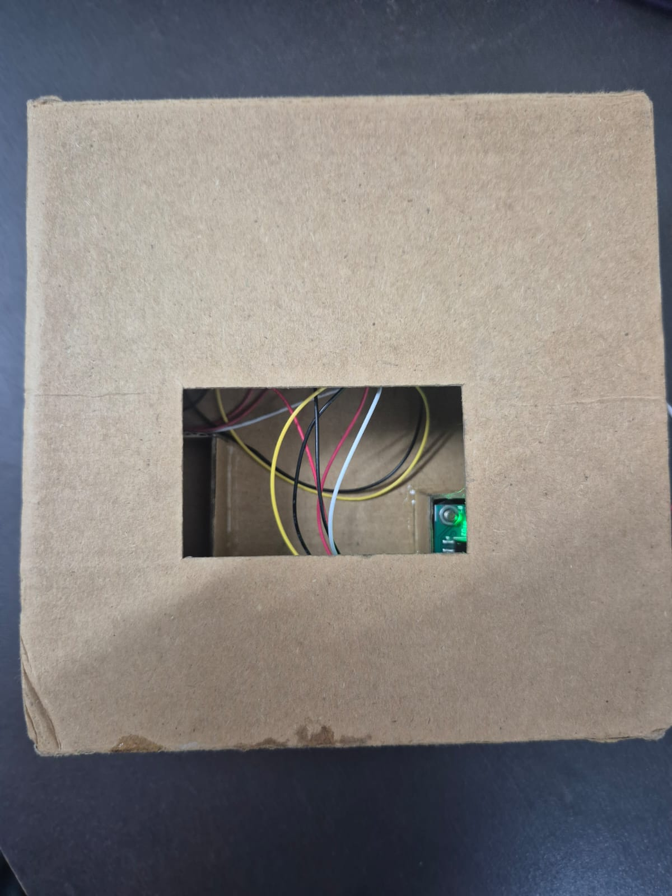
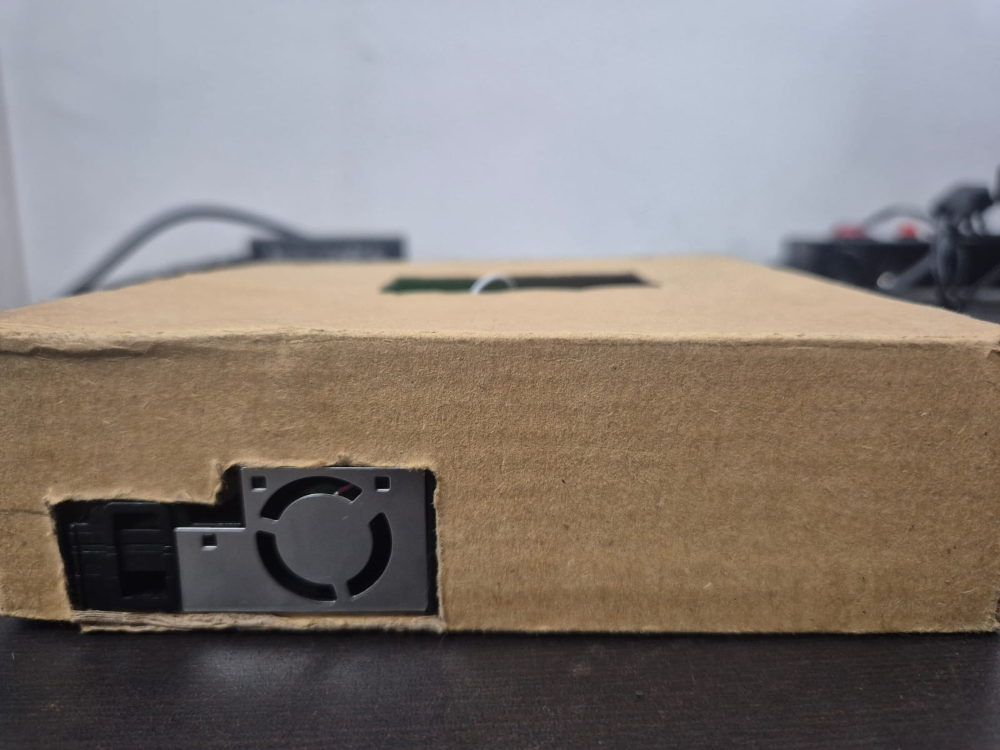
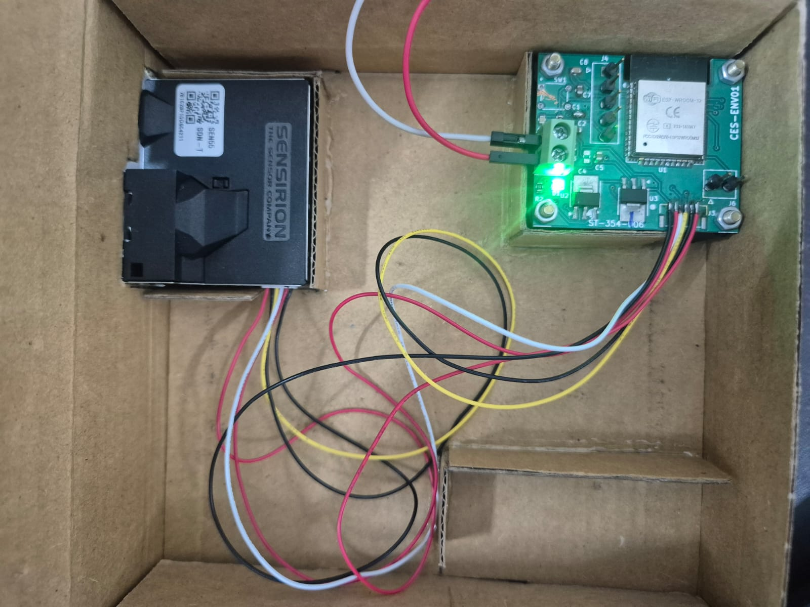
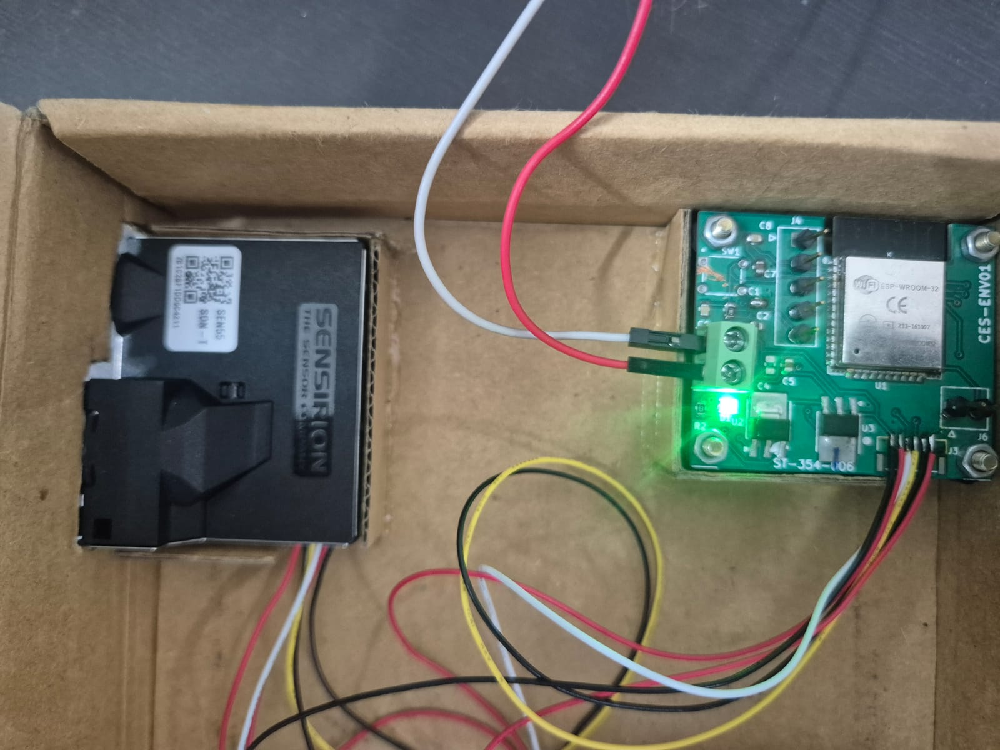
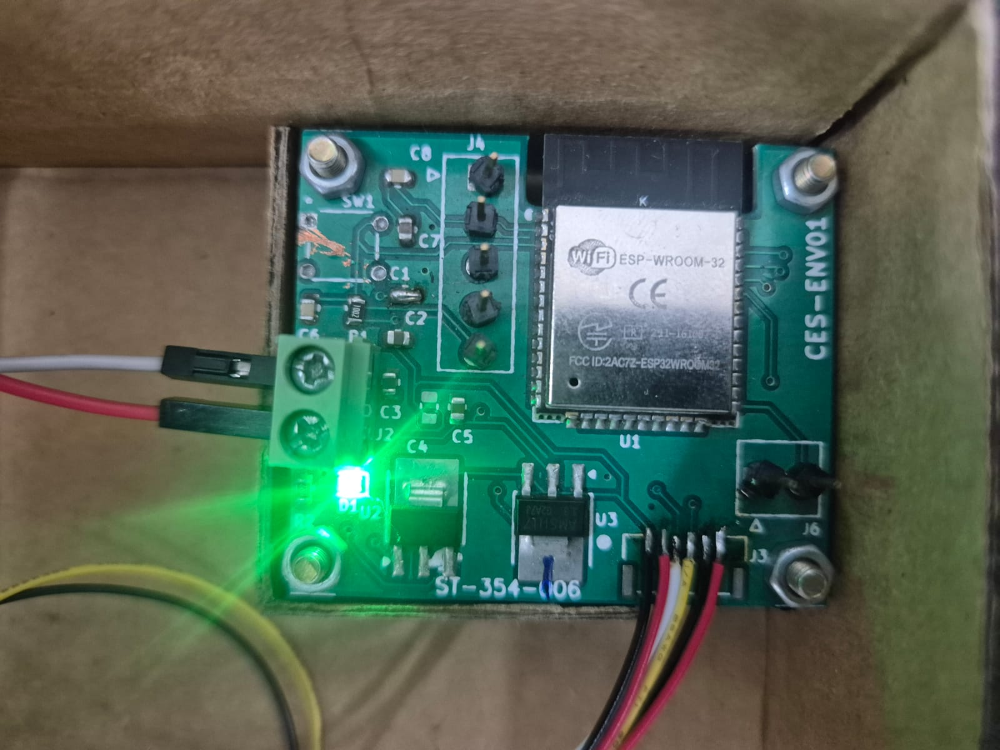

# 🌬️ ESP32 AQI Monitor with Sensirion SEN55

[](https://docs.espressif.com/projects/esp-idf/en/latest/esp32/hw-reference/index.html)
[](https://github.com/espressif/esp-idf)

An advanced Air Quality Monitoring system powered by the **ESP32** and **Sensirion SEN55** sensor. This project provides real-time tracking of various environmental parameters and calculates the **Environmental Protection Agency (EPA) Air Quality Index (AQI)**.

---


## ✨ Features

- **🚀 Multi-parameter Sensing**: 
  - PM1.0, PM2.5, PM4.0, PM10 (Particulate Matter)
  - Temperature & Relative Humidity
  - VOC Index (Volatile Organic Compounds)
  - NOx Index (Nitrogen Oxides)
- **📊 Intelligent AQI Calculation**: Implements official EPA breakpoints for PM2.5, PM10, and NOx.
- **🌐 Real-time Connectivity**: 
  - MQTT Publishing via HiveMQ Broker.
  - Seamless Wi-Fi integration with auto-reconnect logic.
- **🛠️ Dual Framework Support**: Includes both **ESP-IDF** (v5.x) and **Arduino** implementations.
- **🔌 Industrial Grade Communication**: Uses Sensirion's optimized I2C drivers for high reliability.

---

## 🔌 Hardware Requirements

| Component | Description |
| :--- | :--- |
| **ESP32 Dev Board** | ESP32-WROOM, ESP32-S3, or ESP32-C3 |
| **Sensirion SEN55** | Environmental Sensor Node |
| **Wiring** | I2C (SDA/SCL), VCC (5V recommended for SEN55), GND |

### Wiring Diagram
- `SDA` → GPIO 21 (Default)
- `SCL` → GPIO 22 (Default)
- `VCC` → 5V (Note: SEN55 requires 5V for the fan, logic is 3.3V compatible)
- `GND` → GND

### 📸 Hardware Implementation
Visual overview of the physical sensor integration and circuit setup.

| **Top View** | **Side View** |
|:---:|:---:|
|  |  |

| **Assembly** | **Connection** | **Final Setup** |
|:---:|:---:|:---:|
|  |  |  |

---

## ⚙️ Software Configuration

### 1. ESP-IDF (Recommended)
Located in the `main/` directory.

Update your credentials in `main/main.c`:
```c
#define WIFI_SSID     "Your_SSID"
#define WIFI_PASSWORD "Your_Password"
```

**Build & Flash:**
```bash
idf.py set-target esp32
idf.py build
idf.py -p [PORT] flash monitor
```

### 2. Arduino IDE
Located in `aqi-sen55-ino/aqi-sen55/`.

**Dependencies:**
- `Sensirion I2C SEN5X` Library
- `PubSubClient` Library
- `WiFi` Library

---

## 📡 MQTT Data Format

Data is published as a JSON payload to the configured topic:

```json
{
  "pm1": 5.2,
  "pm2_5": 8.3,
  "pm4": 10.1,
  "pm10": 12.5,
  "temp": 25.45,
  "rh": 55.2,
  "voc": 120.5,
  "nox": 15.3,
  "aqi": 42
}
```

---

## 📈 AQI Reference Table

The project calculates AQI based on the following EPA standards:

| AQI Category | Range | PM2.5 (µg/m³) | PM10 (µg/m³) |
| :--- | :--- | :--- | :--- |
| **Good** | 0-50 | 0.0-12.0 | 0-54 |
| **Moderate** | 51-100 | 12.1-35.4 | 55-154 |
| **Unhealthy (Sens.)** | 101-150 | 35.5-55.4 | 155-254 |
| **Unhealthy** | 151-200 | 55.5-150.4 | 255-354 |
| **Very Unhealthy** | 201-300 | 150.5-250.4 | 355-424 |
| **Hazardous** | 301-500 | 250.5-500.4 | 425-604 |

---

## 📁 Project Structure

```text
├── CMakeLists.txt              Project-level CMake configuration
├── main/                       ESP-IDF Source Code
│   ├── main.c                  Application entry point & logic
│   ├── sen5x_i2c.c/.h          SEN5x sensor driver
│   └── sensirion_i2c_hal.c/.h  I2C HAL for ESP-IDF
├── aqi-sen55-ino/              Arduino Source Code
│   └── aqi-sen55/
│       └── aqi-sen55.ino       Arduino Sketch
├── pcb-designs/                Hardware design files & schematics
└── README.md                   Project documentation
```

---

## 👥 Authors

- **Anurag Doshi** (*ChipIOT Embedded System*)
- **Ashutosh Swamy**
- **Shlok Parge**
- **Aaryan Sharma**
- **Naman Vangani**


---

## 📜 Ownership

This project is owned by **ChipIOT**. Sensirion drivers are subject to their own open-source licensing.


